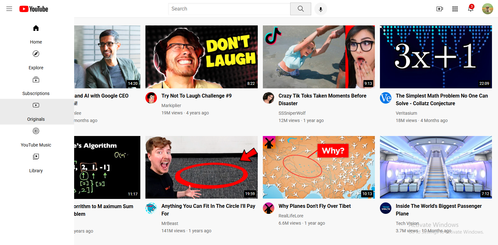

# YouTube_clone
Learning project: A front-end clone of YouTube built using HTML, CSS

---

## 📸 Screenshots

---

## 🎯 Purpose of the Project

This project helped me understand:

- Page layout design
- CSS positioning and alignment
- Flexbox / Grid usage
- Structuring HTML properly

---

## ▶️ How to Run the Project

1. Download or clone the repository
2. Open index.html in your browser

---

## 🙋‍♀️ Author

*Harshitha K C*  
Computer Science Student | Front-End Learner

## 🤝 Connect With Me
 
💼 LinkedIn: https://www.linkedin.com/in/harshitha-kc14 
💻 GitHub: https://github.com/Harshithakc14
---

## ⭐ If you like this project, give it a star!
